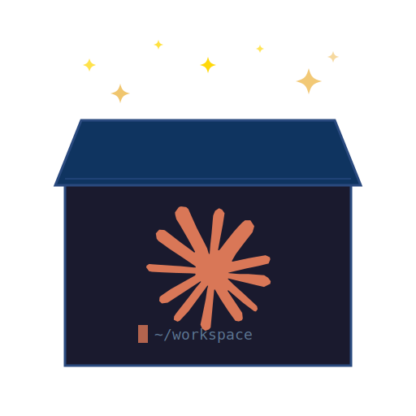

<p align="center">
  
</p>

# ClaudeBox

A dedicated remote development server with Claude Code CLI and essential dev tools pre-installed. Deploy to **Railway** or **DigitalOcean** — your choice.

## Why

I stopped writing code. I stopped reading code. Claude does both now.

So why am I still carrying a Macbook around like I'm the one who needs the compute?

ClaudeBox puts the dev environment where it belongs — on a server, in the cloud, accessible from anywhere. SSH in from an iPad, a Chromebook, your phone, whatever. Claude writes the code, agent-browser tests it, wormhole shares it. Your job is to think and type directions.

The Macbook stays home. You don't.

## What's Included

| Tool | Purpose |
|------|---------|
| Claude Code CLI | AI coding assistant |
| Agent Browser | Headless browser automation for testing web apps |
| Playwright | Browser automation and end-to-end testing framework |
| GitHub CLI | Git operations, PRs, issues |
| Vercel CLI | Frontend deployments |
| Supabase CLI | Backend/database management |
| Docker | Container management |
| Wormhole | Tunnel localhost to internet (HTTPS) |
| Rust + Cargo | Systems programming |
| Python 3.13 + uv | Python dev with fast package management |
| Node.js 22 | JavaScript runtime |
| Go | For Go-based tooling |
| noVNC | Browser-based remote desktop (screen sharing) |

## Deploy

Pick a cloud provider and run the corresponding GitHub Actions workflow.

| Provider | Deploy | Undeploy | Secrets Needed |
|----------|--------|----------|----------------|
| **Railway** | "Deploy to Railway" | "Undeploy from Railway" | `RAILWAY_TOKEN`, `SSH_PUBLIC_KEY`, `GH_TOKEN`* |
| **DigitalOcean** | "Deploy to DigitalOcean" | "Undeploy from DigitalOcean" | `DIGITALOCEAN_ACCESS_TOKEN`, `SSH_PUBLIC_KEY`, `GH_TOKEN`* |

\* `GH_TOKEN` is optional — a GitHub Personal Access Token to auto-authenticate `gh` CLI on the devbox.

### Quick Start

1. Push this repo to GitHub
2. Add the required **secrets** for your chosen provider (Settings → Secrets → Actions)
3. Go to **Actions** → pick your deploy workflow → **Run workflow**
4. SSH in as root and run the login script (see below). For DigitalOcean, setup runs in the background via cloud-init — the login script will wait automatically. You can monitor progress with:

```bash
ssh root@<host> 'tail -f /var/log/devbox-setup.log'
# Setup is done when you see "ClaudeBox setup complete!"
```

5. Start coding:

```bash
ssh claude@<host>         # non-root, full autonomy mode
cd /workspace && claude
```

See [`cloud-providers/railway/`](cloud-providers/railway/) or [`cloud-providers/digitalocean/`](cloud-providers/digitalocean/) for provider-specific details.

## Logging into Claude (First Time)

Claude Code requires a one-time OAuth login. The login script automates the setup and starts a remote-control session accessible from the Claude app or claude.ai/code.

### Using the login script (recommended)

1. SSH into the devbox as root:

```bash
ssh root@<host>
```

2. Run the login script:

```bash
./login-claude.sh
```

3. The script will launch Claude, navigate the setup prompts, and print an OAuth URL.

4. Open the URL in your local browser and sign in with your Anthropic account.

5. After signing in, copy the auth code and paste it back into the terminal.

6. The script completes login, starts a remote-control session, and prints the connection URL.

### Manual login

If the script doesn't work, you can do it manually:

1. SSH in as root:

```bash
ssh root@<host>
```

2. Start VNC and open it in your browser:

```bash
start-vnc
# Open http://<host-ip>:6080/vnc.html
```

3. In a tmux session, run Claude:

```bash
tmux new -s claude
claude
```

4. Claude will show a `/login` prompt. Follow it — an OAuth URL will appear and a browser will open on the VNC desktop.

5. Log in via the VNC browser, copy the auth code, and paste it into the terminal.

6. Stop VNC when done:

```bash
start-vnc --stop
```

### After login

SSH as the `claude` user for full autonomy mode (`--dangerously-skip-permissions`):

```bash
ssh claude@<host>
cd /workspace
claude
```

Use `root` for admin tasks (installing tools, managing services). Use `claude` for coding.

## tmux

Keep Claude running in a tmux session so it persists across SSH disconnects.

```bash
tmux new -s claude        # New session named 'claude'
tmux attach -t claude     # Reattach to it later
# Ctrl+B then D           # Detach (keeps session running)
tmux ls                   # List sessions
```

## Usage

SSH into the server, then:

```bash
# Start coding with Claude
cd /workspace
git clone https://github.com/your/project.git
cd project
claude

# Expose dev server to internet
wormhole http 3000

# Test the app with headless browser
agent-browser open "http://localhost:3000"
agent-browser screenshot /tmp/page.png
```

## Screen Sharing

View your app's browser in real time from any device — like desktop screen sharing:

```bash
# Start the virtual desktop
start-vnc

# Share it over the internet
wormhole http 6080
# Open the URL + /vnc.html in your browser

# Launch a browser on the virtual desktop
DISPLAY=:99 chromium-browser --no-sandbox http://localhost:3000 &

# Stop when done
start-vnc --stop
```

Set `ENABLE_VNC=true` as an env var to auto-start on boot.

## Ports

Port 22 (SSH) is exposed by default. Other ports depend on your provider — expose them through your provider's networking settings or tunnel them via wormhole.
