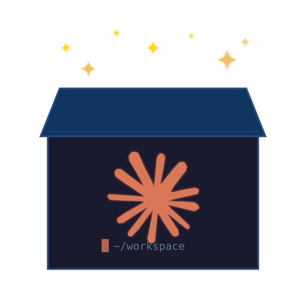
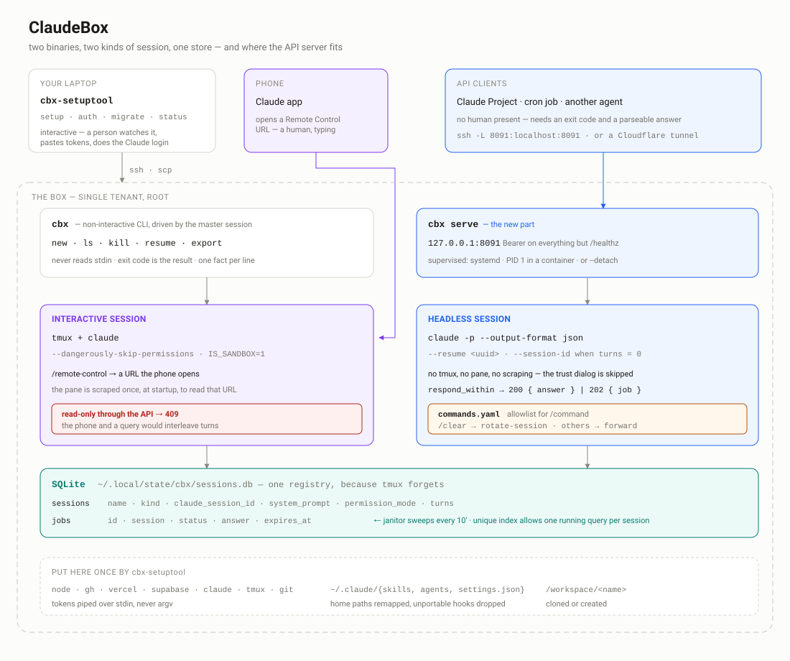

<p align="center">
  
</p>

# ClaudeBox

Your own Claude Code agent, always on, reachable from your phone.

A box in the cloud runs Claude Code sessions you can open from the Claude app —
no laptop required, nothing to keep awake.

<p align="center">
  
</p>

## Two commands

ClaudeBox is two binaries because it does two unrelated jobs.

**`cbx-setuptool`** runs on your laptop and prepares a machine. Interactive: it
shows progress, asks for tokens, and hands you the Claude sign-in.

**`cbx`** runs on the box and manages sessions. Non-interactive: it never
prompts, never reads stdin, and prints one tab-separated fact per line, because
its caller is the Claude session itself.

See [docs/two-binaries.md](docs/two-binaries.md) for why.

## Getting started

Create an Ubuntu machine with your SSH key on it — a DigitalOcean droplet, or
anything you can `ssh root@` into. Then, from your laptop:

```bash
# grab cbx-setuptool for your laptop from the latest release
curl -fsSL -o cbx-setuptool \
  https://github.com/vutran1710/claudebox/releases/latest/download/cbx-setuptool-darwin-arm64
chmod +x cbx-setuptool

./cbx-setuptool setup --host <ip> --with-api
```

That installs the tool chain, downloads `cbx` onto the box, signs Claude Code
in, authenticates `gh`/`vercel`/`supabase` from tokens, and copies your skills
and settings across. Each step is skipped if already done, so re-running after
a failure is cheap.

`cbx` is fetched from a release matching this tool's own version — the two are
built from the same commit, so pairing them is what stops a setuptool
configuring a `cbx` that lacks the command it just wrote a unit for. Pin one
with `--cbx-version v0.9.0`, or upload a local build with `--binary ./cbx-linux`
when testing something unreleased:

```bash
GOOS=linux GOARCH=amd64 go build -o cbx-linux ./cmd/cbx
./cbx-setuptool setup --host <ip> --binary ./cbx-linux
```

Then start the always-on session and open its URL on your phone:

```bash
ssh root@<ip> cbx new master
```

## `cbx` — on the box

```
cbx new <name> [--repo owner/repo]   start a session, print its Remote Control URL
cbx ls                                every session, and whether it is running
cbx resume <name>                     a running session's URL and attach command
cbx kill <name>                       stop it and forget it
cbx export skills|rules|db            what this box has, to stdout
```

Sessions are recorded in SQLite, so a session that dies is reported `stopped`
rather than vanishing, and a Remote Control URL survives a tmux restart.

## `cbx-setuptool` — on your laptop

```
cbx-setuptool setup   --host <ip> [--with-api]          the whole flow
cbx-setuptool auth    --host <ip> [github|vercel|supabase]
cbx-setuptool migrate --host <ip> [--claude-dir <dir>] [--filter a,b]
cbx-setuptool status  --host <ip>    what is installed and authenticated
```

Tokens are piped over SSH into each tool's own login rather than passed as
arguments, where they would be visible in the box's process table. A token
already in your environment (`GH_TOKEN`, `VERCEL_TOKEN`,
`SUPABASE_ACCESS_TOKEN`) is used without asking.

`migrate` copies the parts of a Claude configuration directory that shape a
session — by default `skills`, `agents`, `rules`, `settings.json` and the
plugin manifest. `--claude-dir` picks which directory to copy from, and
`--filter` picks what inside it travels, so neither is fixed.

`settings.json` is rewritten on the way: paths under your home directory are
remapped, and hooks calling binaries the box does not have are dropped and
reported. Copied verbatim they would fail on every edit inside every session.

Each entry is reported with the number of files it actually sent, because a
directory of symlinks into a dotfiles repository once migrated as empty and
was reported as copied.

## Testing

```bash
go test ./...              # unit and integration, drives real tmux and SQLite
scripts/smoke-api.sh       # drive the HTTP API against the Claude on this machine
scripts/smoke.sh --create  # provision a real droplet, drive it, destroy it
```

`cbx` has no remote dependency, so it is fully testable on a laptop. The smoke
test exists because fakes cannot model a shell, a PATH, an installer that exits
0 having done nothing, or Claude asking to trust a folder — every serious bug in
this project was found by running against a real box.

## Docs

- [docs/two-binaries.md](docs/two-binaries.md) — why the split
- [docs/api-server.md](docs/api-server.md) — the API server, and why it is not `cbx serve` returning
- [docs/decision-log.md](docs/decision-log.md) — choices made, why, and what would make each wrong
