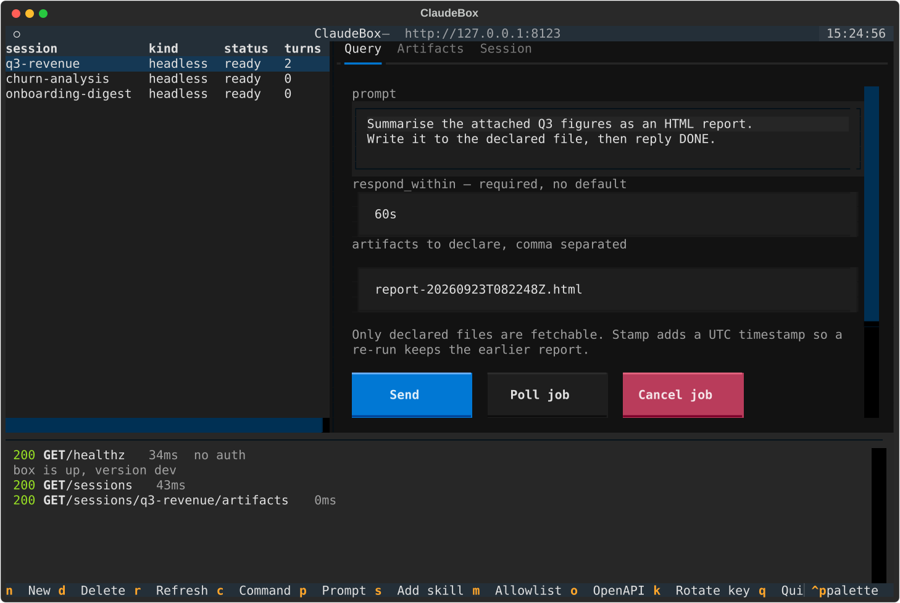
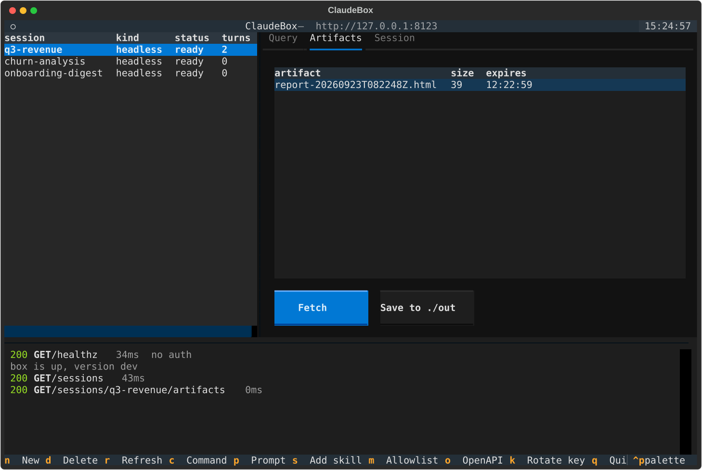
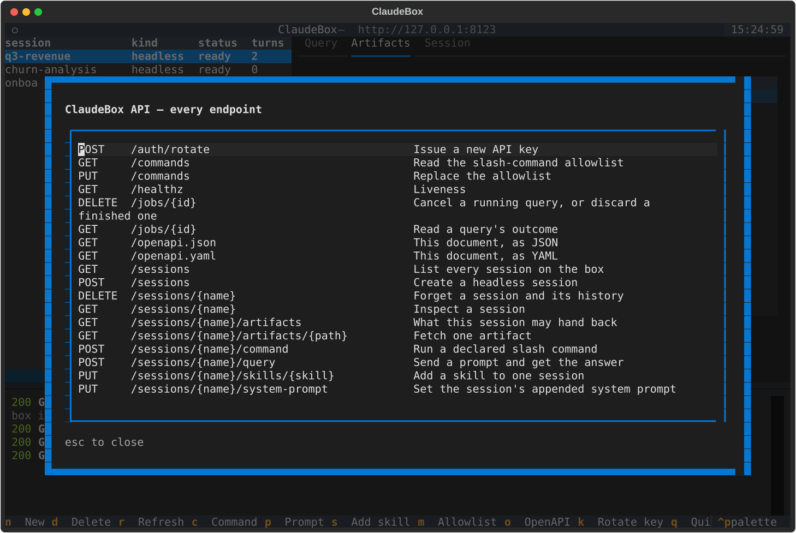
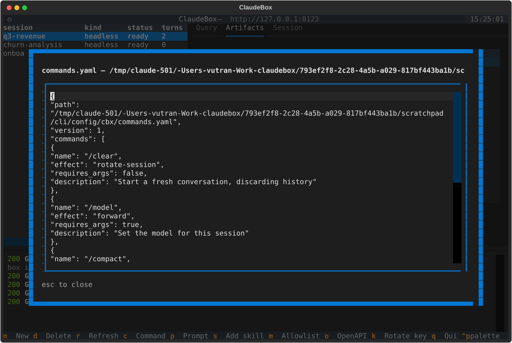
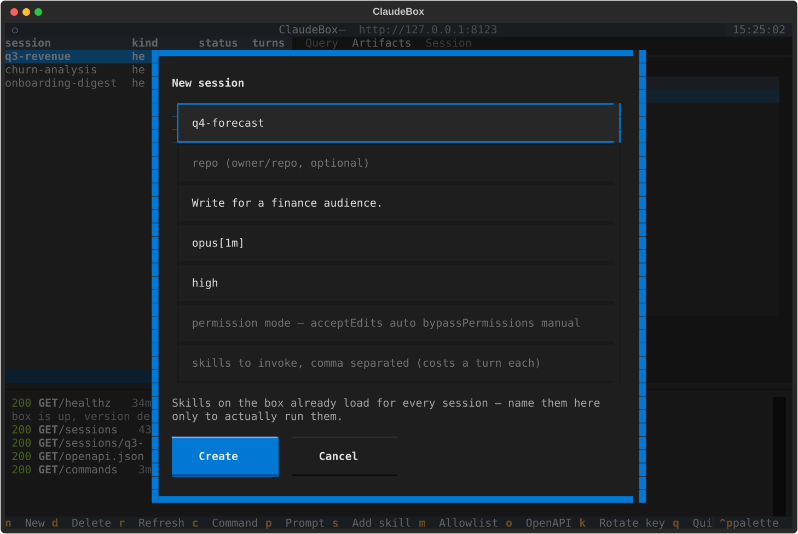

# Python client

Two files. `claudebox.py` talks to the API and has no opinions about how you
use it; `tui.py` is a terminal client built on top, for poking at every
endpoint by hand.

<p align="center">
  
</p>

## The TUI

```bash
uv run clients/python/tui.py \
  --url http://127.0.0.1:8091 \
  --key "$(ssh root@box cbx api-key show | cut -f2)"
```

`CLAUDEBOX_URL` and `CLAUDEBOX_KEY` work instead of the flags. The API binds
loopback on the box, so reach it with a port-forward first:

```bash
ssh -N -L 8091:localhost:8091 root@box &
```

Every request appears in the log at the bottom with its status and duration.
That is the point of this client — to show the API working rather than hide
it.

| key | |
|---|---|
| `n` `d` `r` | new session · delete · refresh |
| `c` | run a slash command from the box's allowlist |
| `p` `s` | append to the system prompt · add a skill to this session |
| `m` `o` | show the command allowlist · list every endpoint from OpenAPI |
| `k` | rotate the API key — the old one dies immediately |

**Stamp**, next to the artifacts field, adds a UTC timestamp to each declared
name. Two queries in one session that both write `report.html` leave one
report, and the box cannot know which you wanted.

| | |
|---|---|
|  |  |
| What this session may hand back — only declared outputs, with their 4h expiry. | Every endpoint, listed from the box's own OpenAPI document. |
|  |  |
| The slash-command allowlist. Anything not in it is refused. | Model, effort and permission mode are fixed when the session is created. |

## The client

```python
from claudebox import ClaudeBox, timestamped

with ClaudeBox("http://127.0.0.1:8091", key) as box:
    box.create("report-42", system_prompt="Be concise.")

    name = timestamped("report.html")      # report-20260923T081327Z.html
    answer = box.query_and_wait(
        "report-42",
        f"Write {name} summarising the attached figures, then reply DONE.",
        respond_within="3m",
        artifacts=[name],                  # only declared files are fetchable
    )

    open(name, "wb").write(box.fetch("report-42", name))
    box.delete("report-42")
```

Three things it handles so you do not have to:

**A query answers `200` or `202`.** Both are normal — `202` means the window
closed while Claude was still working, and the answer will be in the job.
`query_and_wait` folds that away; `query` hands back whichever arrived.

**`respond_within` is required.** There is no default because only the caller
knows what it can hold open. The client asks for it rather than inventing one.

**Only declared files come back.** The session directory holds a cloned
repository, scratch files and whatever else a turn wrote. Naming a file in
`artifacts` is what makes it fetchable; nothing else ever is.

`ClaudeBoxError` carries the status, because several mean something specific —
`409` is a session already running a query (`err.session_busy`), `502` is
Claude failing rather than your request being wrong.

## For a backend

Lift `claudebox.py` as it is. It has one dependency, no TUI imports, and
`on_call` points at your logger. The sequence a report service runs is the
snippet above.
